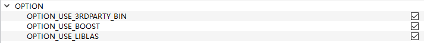
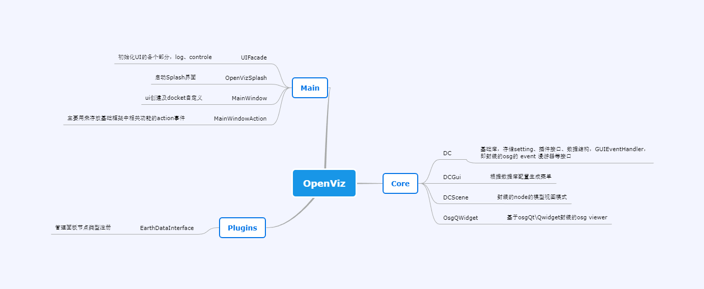
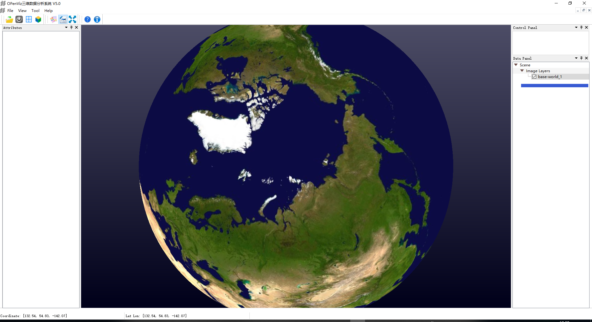
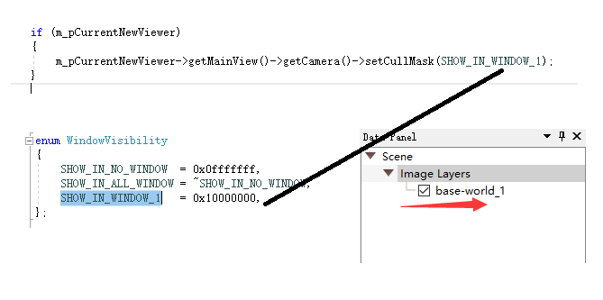
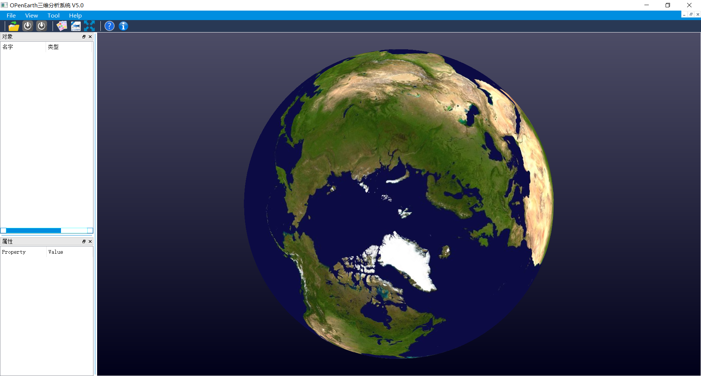
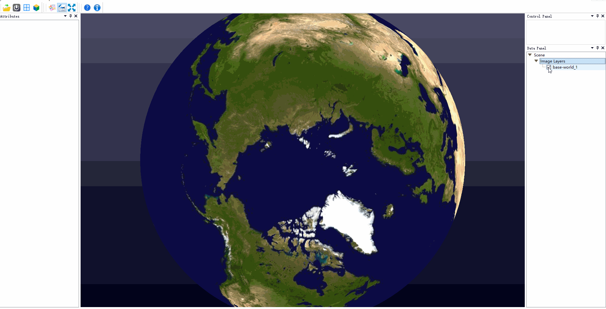

# OpenVizEarth
qt5 osg3.6 osgearth vs2015

start: PATH=H:\osgearthSDK\bin;G:\library\qt\bin

## 编译

1. 使用camke 3.0以上版本；
2. 

## 项目结构

1. 主结构

   

2. UIFacade 界面初始化

   

3. 节点树管理

   

4. 节点选中隐藏显示逻辑，通过node的mask属性控制

## 使用osgearth结合qt制作demo工程

1. 主界面
2. 节点隐藏显示控制

