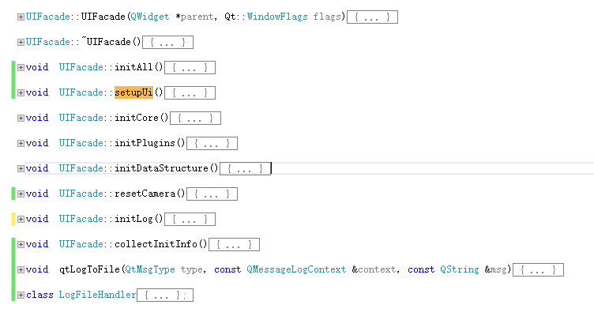

# OpenVizEarth
qt5 osg3.6 osgearth vs2015

start: PATH=H:\osgearthSDK\bin;G:\library\qt\bin

依赖库包网盘地址：

转存的别人编译的

链接：https://pan.baidu.com/s/19pZiIGzDLeijmq5pJfu7Iw 
提取码：pytl 

## 编译

1. 使用camke 3.0以上版本；
2. 
3. 使用的本地库路径  
qt:G:/library/qt/vs_2015_x64_570/5.7/msvc2015_64/lib/cmake/Qt5Widgets
osg:3.6: OpenSceneGraph-OpenSceneGraph-3.6.zip
osgearth:osgearth-osgearth-2.10.zip
thirdParty:H:\osgearthSDK\3rdParty
boost:H:\3.open\3rdparty\x64\boost_1_60_0
liblas:H:\3.open\3rdparty\x64\liblas18
ssgqt: osgQt-3.5.7
4.CMake的变量配置，因为makelist中使用了这些名称对应的路径
 INCLUDE_DIRECTORIES(
    ${OSG_INCLUDE_DIR}
    ${OSGQT_INCLUDE_DIR}
    ${OSGEARTH_INCLUDE_DIR}
   )
 LINK_DIRECTORIES(
    ${OSG_ROOT}/lib
    ${OSGQT_ROOT}/lib
    ${OSGEARTH_ROOT}/lib
    )

## 项目结构

1. 主结构

   

2. UIFacade 界面初始化

   

3. 节点树管理  
   

4. 节点选中隐藏显示逻辑，通过node的mask属性控制

5. 模仿arcgis工具箱

## 使用osgearth结合qt制作demo工程

1. 主界面
2. 节点隐藏显示控制

